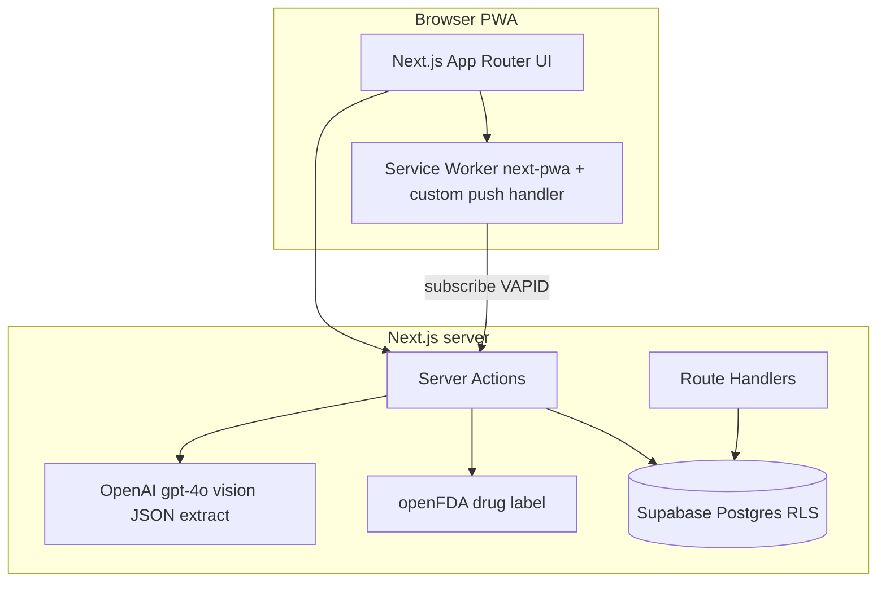

# MedMinder AI

Progressive Web App for **medication adherence** and **safety-oriented screening**, aimed at mobile-first, high-contrast UX. The product direction is documented in `PROJECTPLAN.md`(accuracy-first, official FDA data for grounding, minimal PHI retention).

This README describes **what is implemented today** in the repository, not the full future roadmap.

---

## Table of contents

1. [Architecture](#architecture)
2. [Tech stack](#tech-stack)
3. [Implemented features](#implemented-features)
4. [Data model (Supabase / Postgres)](#data-model-supabase--postgres)
5. [Application flows](#application-flows)
6. [Server surface](#server-surface)
7. [Environment variables](#environment-variables)
8. [Local development](#local-development)
9. [Database migrations](#database-migrations)
10. [PWA and Web Push](#pwa-and-web-push)
11. [Operations and smoke testing](#operations-and-smoke-testing)
12. [Security and privacy notes](#security-and-privacy-notes)
13. [Repository layout](#repository-layout)
14. [Known gaps vs plan](#known-gaps-vs-plan)

---

## Architecture



- **UI**: React 18, App Router, Tailwind, shadcn-style UI primitives, `react-i18next` (EN / KO / ES).
- **Backend logic**: Next.js **Server Actions** for prescription analysis, persistence, schedule materialization, push subscription storage, and DDI analysis orchestration.
- **Data**: Supabase Auth + Postgres with **RLS** on `profiles`, `medications`, `adherence_logs`.
- **External services**: OpenAI (vision JSON extraction), openFDA (label search and DDI-related label/event signals).

---

## Tech stack

| Layer | Choice |
|--------|--------|
| Framework | Next.js **14.2** (App Router), TypeScript **5** |
| Styling | Tailwind CSS 3, `class-variance-authority`, `tailwind-merge` |
| Auth + DB | Supabase (`@supabase/supabase-js`, `@supabase/ssr`) |
| i18n | `i18next`, `react-i18next` |
| PWA | `next-pwa` (Workbox; **disabled in development**) |
| Push | `web-push` (VAPID), custom push handling in `src/worker/index.ts` |
| Icons | `lucide-react` |

---

## Implemented features

### Prescription capture and parsing

- Hidden file input with `capture="environment"` for camera-first mobile capture; accepts **JPEG, PNG, WebP, GIF**.
- **Server Action** `analyzePrescription`: image validated (MIME, max **6 MiB** — aligned with `experimental.serverActions.bodySizeLimit` **7mb** in `next.config.mjs`).
- **OpenAI** `gpt-4o` with `response_format: json_object`, low temperature, structured keys: `drug_name`, `dosage`, `frequency`, `raw_instructions`. System prompt instructs faithful transcription and **no invented drug names**.

### openFDA verification (post-parse)

- `fetchOpenFdaLabels` queries `https://api.fda.gov/drug/label.json` with brand/generic search; timeout and scoring via `bestFdaMatch` / string similarity helpers in `src/lib/prescription/fda-match.ts`.
- User-facing result includes verification state (`verified` | `not_found` | `unverified`), optional `fda_match`, suggestions, and a confidence score used in the verification UI.

### Human-in-the-loop save

- **Verification modal** and optional **correction form** before commit.
- **Server Action** `saveVerifiedMedication`: requires authenticated Supabase user and existing `profiles` row; updates `profiles.locale` from client language (must be `en` | `ko` | `es`); inserts `medications`; inserts an initial `adherence_logs` row as **taken** at current time (onboarding-style “first dose logged” behavior).

**Verification UI (`VerificationModal.tsx`)** — After `analyzePrescription`, the modal shows read-only fields aligned with `ParsedPrescription`: **drug name**, **dosage**, **frequency**, **raw instructions** (SIG). On success it also surfaces **openFDA status** (amber banner when `not_found` or `unverified`), the **matched FDA label name** and `match_type` when `verified`, and a **confidence score** (0–1 shown as percent). Actions: confirm (runs `onConfirm` → `saveVerifiedMedication` with vision output), request edit (opens correction flow), or dismiss (backdrop / close). Parse failures use an **alertdialog** with `result.message` only.

**Correction UI (`CorrectionForm.tsx`)** — Same four fields as editable inputs; **drug name**, **dosage**, and **frequency** are required before the internal “review” step (trilingual inline hints). **Drug name** offers a filterable **openFDA suggestion list** (`fda_suggestions`) when the user focuses or types. **raw_instructions** remains optional. Flow: **edit** → **confirm** (summary `dl`) → **save** via `saveVerifiedMedication(buildParsed(), locale)` → brief **success** state then `onSaveSuccess`. Users can return to the verification summary or abandon without saving.

### Today’s schedule and adherence

- **Timezone-aware** scheduling: `profiles.timezone` drives “today” window in UTC via helpers in `src/lib/prescription/scheduler.ts`.
- **Heuristic frequency → slot times**: maps common EN/KO/ES patterns and intervals to local `HH:mm` slots; **PRN / as-needed** yields **no** auto-generated scheduled rows (avoids false deadlines).
- **Server Action** `ensureAndFetchTodaySchedule`: upserts `adherence_logs` with `status = 'scheduled'` for today’s slots (`onConflict: medication_id,scheduled_time`); returns joined medication names.
- **Server Action** `markAdherenceLogTaken`: sets `taken` + `taken_at`.
- UI: **next dose hero**, **daily timeline**, success **haptic** (`src/lib/haptics.ts`).

### Drug–drug interaction (DDI) screening (informational)

- **Server Action** `analyzeDdiForCurrentUser`: loads distinct medication names for the signed-in user, runs `analyzeDrugDrugInteractions` in `src/lib/prescription/ddi-checker.ts`.
- Uses openFDA **label** sections (e.g. drug interactions text) and supporting logic with **server-side caching** and optional `OPENFDA_API_KEY` for rate limits.
- **Not** a clinical decision support certification; findings are presented as safety banners and a detail modal — appropriate disclaimers belong in product copy/legal review.

### Web Push (subscription persistence + test send)

- **Server Actions** `savePushSubscription`, `clearPushSubscription`, `sendTestPushToCurrentUser` (`src/app/actions/notifications.ts`).
- Subscription JSON stored on `profiles.push_subscription`.
- Client banner (`PushNotificationBanner`) subscribes via `navigator.serviceWorker.ready` + VAPID public key; **disabled UX path in development** (no production service worker).
- Custom worker code in `src/worker/index.ts` handles `push` and `notificationclick` with localized defaults (en/ko/es).

### Internationalization

- `I18nProvider` + locale JSON under `src/locales/` (e.g. `en/common.json`). In-app language switcher on the main dashboard updates `i18n` and `document.documentElement.lang`.

### Debug and quality gates

- **`/test-db`**: client-side Supabase session + `medications` list for manual RLS verification. **Blocked in production** by `src/middleware.ts` unless `ENABLE_TEST_DB=true`.
- **`GET /api/health`**: minimal JSON for uptime checks.
- **`POST /api/smoke/payload`**: multipart size/MIME probe when `SMOKE_TEST_SECRET` is set (Bearer auth). App max image size is 6MiB (`MAX_PRESCRIPTION_IMAGE_BYTES`); **Vercel serverless request bodies are ~4.5MB**, so very large multipart probes can return **413** before this route runs.
- **`scripts/prod-smoke.mjs`**: production smoke for manifest, service worker, health, openFDA, optional OpenAI, and `/api/smoke/payload`. Loads `.env` / `.env.local`; supports **Vercel Deployment Protection** via `VERCEL_AUTOMATION_BYPASS_SECRET` (header `x-vercel-protection-bypass`). On Vercel, payload checks use a **4MiB** in-route probe and treat **6MiB → 413 `FUNCTION_PAYLOAD_TOO_LARGE`** as expected platform behavior (see script header).

---

## Data model (Supabase / Postgres)

Defined in `supabase/migrations/`. Highlights:

| Table | Purpose |
|--------|---------|
| `profiles` | `id` = `auth.users.id`, `locale` (`en`/`ko`/`es`), `timezone`, `push_subscription` (JSONB, nullable) |
| `medications` | Structured fields only; **no prescription image blobs** (PHI minimization) |
| `adherence_logs` | `status`: `taken` \| `missed` \| `scheduled`; `scheduled_time`, `taken_at` as `timestamptz` |

**Integrity**: trigger `enforce_adherence_medication_profile` ensures `medication_id` belongs to the same `profile_id` as the log.

**RLS**: per-user `select/insert/update/delete` on all three tables keyed by `auth.uid()`.

**Auth hook**: `handle_new_user` creates a `profiles` row on signup (default `locale = 'en'`, `timezone` from user metadata or `UTC`).

---

## Application flows

1. **Scan → analyze (server)** → openFDA match → **verify modal** → optional **correction** → **save** → DB rows.
2. **Dashboard load** → `ensureAndFetchTodaySchedule` → timeline + next dose → user marks doses taken.
3. **Parallel**: `analyzeDdiForCurrentUser` after schedule load to refresh safety banner/modal.
4. **Push**: user enables notifications (prod) → subscription saved → optional test push from server.

---

## Server surface

| Kind | Path / name | Notes |
|------|----------------|-------|
| Server Action | `analyzePrescription`, `saveVerifiedMedication` | `src/app/actions/medication.ts` |
| Server Action | `ensureAndFetchTodaySchedule`, `markAdherenceLogTaken` | `src/app/actions/adherence-schedule.ts` |
| Server Action | `analyzeDdiForCurrentUser` | `src/app/actions/ddi-check.ts` |
| Server Action | `savePushSubscription`, `clearPushSubscription`, `sendTestPushToCurrentUser` | `src/app/actions/notifications.ts` |
| Route | `GET /api/health` | `src/app/api/health/route.ts` |
| Route | `POST /api/smoke/payload` | Bearer `SMOKE_TEST_SECRET`; validates multipart limits |

The correction flow calls the same `saveVerifiedMedication` action with user-edited structured fields (`CorrectionForm.tsx`).

---

## Environment variables

Copy [`.env.example`](./.env.example) to `.env.local`, set values locally, and keep secrets out of git (see `.gitignore`).

| Variable | Scope | Purpose |
|----------|--------|---------|
| `NEXT_PUBLIC_SUPABASE_URL` | public | Supabase project URL |
| `NEXT_PUBLIC_SUPABASE_ANON_KEY` | public | Supabase anon key (RLS-bound) |
| `OPENAI_API_KEY` | server | Prescription vision extraction |
| `OPENFDA_API_KEY` | server | Optional; higher openFDA quotas |
| `NEXT_PUBLIC_VAPID_PUBLIC_KEY` | public | Web Push applicationServerKey |
| `VAPID_PRIVATE_KEY` | server | Web Push signing |
| `VAPID_PUBLIC_KEY` | server | Alternate name accepted by notification action |
| `VAPID_SUBJECT` | server | VAPID subject (`mailto:` or `https:`) |
| `SMOKE_TEST_SECRET` | server | Enables `/api/smoke/payload` and auth for smoke script |
| `ENABLE_TEST_DB` | server | Set `true` to allow `/test-db` outside development |
| `NEXT_PUBLIC_BASE_URL` / `BASE_URL` | tooling | Used by `scripts/prod-smoke.mjs` |
| `VERCEL_AUTOMATION_BYPASS_SECRET` | tooling | Optional; same value as Vercel → **Deployment Protection** → **Protection Bypass for Automation**. Local `npm run smoke:prod` sends `x-vercel-protection-bypass` so probes hit the app behind protection. Alias: `VERCEL_PROTECTION_BYPASS`. |

`next.config.mjs` also maps `SUPABASE_URL` / `SUPABASE_ANON_KEY` to `NEXT_PUBLIC_*` for build-time injection when needed.

---

## Local development

```bash
cp .env.example .env.local   # then fill in secrets / URLs
npm install
npm run dev
```

Open [http://localhost:3000](http://localhost:3000). Service worker / push UI paths are intentionally limited in development (see `PushNotificationBanner`).

```bash
npm run lint
npm run build
npm start
```

---

## Database migrations

Apply SQL in order under `supabase/migrations/`:

1. `20250412120000_init_schema.sql` — core tables, RLS, signup trigger, adherence/medication consistency trigger.
2. `20250412140000_adherence_scheduled_status.sql` — `scheduled` status + unique index on `(medication_id, scheduled_time)`.
3. `20250412140000_profiles_push_subscription.sql` — `profiles.push_subscription`.

Optional seed: `supabase/scripts/smoke_validation_seed.sql` (see script header for intent).

---

## PWA and Web Push

- **Manifest**: `public/manifest.json`; linked from `src/app/layout.tsx` metadata.
- **Build output**: `next-pwa` generates `public/sw.js` and Workbox assets on **production** build (`disable: NODE_ENV === 'development'`).
- **Custom push behavior**: `src/worker/index.ts` — ensure this file stays compatible with your `next-pwa` version (regenerate after major upgrades).

---

## Operations and smoke testing

From project root, with `NEXT_PUBLIC_BASE_URL` or `BASE_URL` and optional secrets in `.env` / `.env.local` (the script loads them like Next.js):

```bash
npm run smoke:prod
# equivalent:
NEXT_PUBLIC_BASE_URL=https://your-deployment.example SMOKE_TEST_SECRET=... node scripts/prod-smoke.mjs
```

**What it checks**

- **PWA**: `manifest.json`, `sw.js` (production build artifacts).
- **App**: `GET /api/health`.
- **Upstream**: openFDA `drug/label.json` (no spend); optional OpenAI `GET /v1/models` if `OPENAI_API_KEY` is set.
- **Multipart**: `POST /api/smoke/payload` with Bearer `SMOKE_TEST_SECRET` (must match the value on the deployment).

**Vercel-specific**

- **Deployment Protection** (password / Vercel Authentication): set `VERCEL_AUTOMATION_BYPASS_SECRET` locally to the dashboard secret so requests are not **401**. First log line reports whether the bypass header is configured.
- **Request body cap**: Vercel serverless functions enforce roughly **4.5MB** per request (`FUNCTION_PAYLOAD_TOO_LARGE` / **413**). The app still documents a **6MiB** prescription image cap for logic aligned with `next.config.mjs` `serverActions.bodySizeLimit`, but payloads larger than the platform cap never reach your route. The smoke script expects a **4MiB** probe to succeed in-route; a **6MiB** probe may **413** on Vercel (treated as OK with a skip for the in-route “over max” case). For real large uploads, prefer **client → object storage** (e.g. Supabase) rather than sending multi‑MiB bodies through the serverless function.

---

## Security and privacy notes

- **RLS** is the primary authorization boundary for PHI-adjacent structured data.
- **Prescription images** are processed in memory for parsing; they are **not** stored in Postgres by design.
- **VAPID private key** must never use the `NEXT_PUBLIC_` prefix; rotate if exposed.
- **Test routes**: keep `/test-db` disabled in production unless deliberately enabled.

---

## Repository layout

```
src/
  app/                 # App Router: page, layout, API routes, server actions
  components/          # Dashboard, modals, forms, UI primitives
  lib/
    prescription/      # FDA matching, scheduling, DDI analysis, types
    supabase/          # Browser + server Supabase clients
    server/            # e.g. upload limits
  locales/             # i18n JSON
  worker/              # Service worker source (push / click)
supabase/migrations/   # Postgres schema + RLS
scripts/prod-smoke.mjs # Deployment smoke checks
public/                # manifest, icons, generated sw.js (after build)
```

---

## Known gaps vs plan

Aligned with `PROJECTPLAN.md`, items **not** fully delivered in this repo yet include (non-exhaustive):

- Automated **time-based push** campaigns (cron / edge worker) that read `adherence_logs` and fire reminders without manual test send.
- **Physician-ready PDF** adherence reports.
- Deeper **offline-first** data caching beyond Workbox static precache.
- Dedicated **auth UI** flows in-app (current flows assume Supabase session exists when testing RLS-protected actions).

Treat openFDA + vision output as **assistive**; clinical use requires your own validation, labeling, and regulatory process.

---

## License

Private project (`"private": true` in `package.json`). Add a license file if you open-source.
